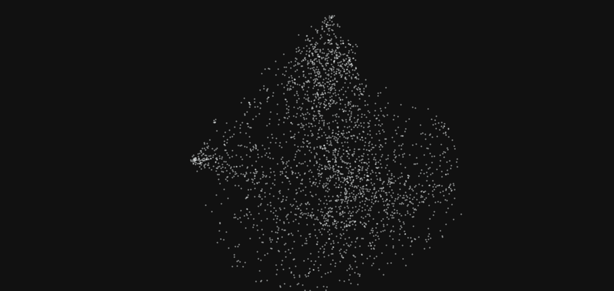
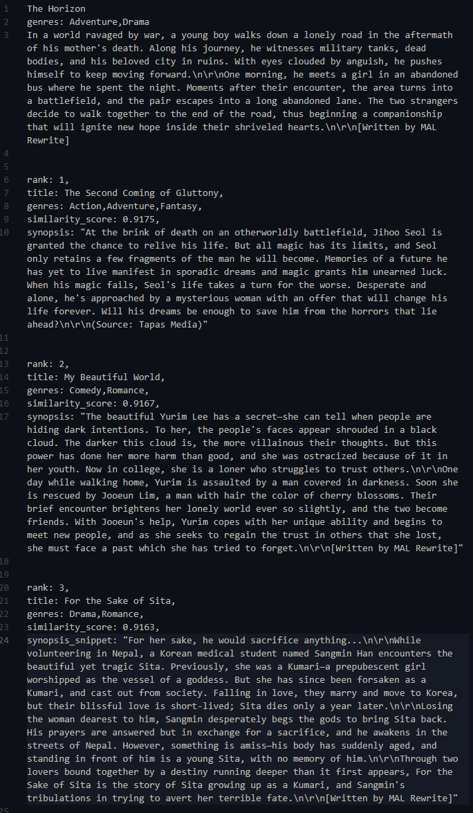
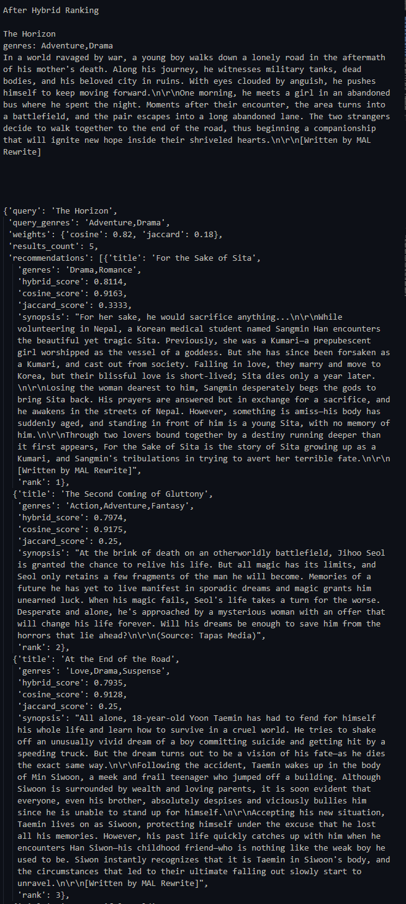

# Synopsis-Based-Manhwa-Recommender
A simple [Manhwa](https://en.wikipedia.org/wiki/Manhwa) Recommender based on a [Kaggle](https://www.kaggle.com/datasets/iridazzle/webtoon-originals-datasets?select=webtoon_originals_en.csv) dataset.
Sources and References:
1. [AnalyticsVidhya](https://www.analyticsvidhya.com/blog/2021/07/recommendation-system-understanding-the-basic-concepts/)
2. [Medium](https://medium.com/@hazallgultekin/what-is-silhouette-score-f428fb39bf9a)
3. [geeksforgeeks](https://www.geeksforgeeks.org/davies-bouldin-index/)

The recommnder is based on dataset of manhwa comics from kaggle. It uses [BERT](https://huggingface.co/docs/transformers/en/model_doc/bert) model to generate embeddings and uses averaged representations. The representation(768 dimensional vectors) are then used for feature selection using [PCA](https://www.ibm.com/think/topics/principal-component-analysis). The idea was to generate latent sub genre categories based on the synopsis embeddings to cluster the titles.


# Procedure
## 1. Preprocessing and BERT
The data for synopsis based recommender only uses synopsis from the iven dataset along with titles. All duplicates and titles with 0 synopsis length or missing values were dropped. The number of samples in this processed dataset is 2688.

The HuggingFace implementation of BERT (`google-bert/bert-base-uncased"`) was used (both for tokenizer and model) to generate embeddings for the synopsis text. Truncation of text due to large sequence length only affects 1 sample. The tensor was then averaged across sequence length to generate a single averaged tensor for the entire synopsis embeddings. This step hopes to capture the essence of the synopsis in a single vector and hence use this representation of the crux of the synopsis to do clustering of similar such vectors.


## 2. Feature Selection, Models and Metrics
### Feature Selection
Pricipal Component Analysis was used to perform feature selection on the 768 dimensional data. The motivation was that reducing number of features may help achieve better scores for various models. Cross referencing various values for number of pricipal components agains the metrics used for the project (Silhouette and Davies Bouldin Score) also suggests lower dimensional data generates better performance for the models.


### Models
Scikit documentation lists all available clustering models ([Here](https://scikit-learn.org/stable/modules/clustering#hierarchical-clustering)) along with thier use cases and other important details such as parameters and scalability. Based on these and some test runs of various models (including DBSCAN, HDBSCAN, OPTICS and BIRCH), I chose the following four models to work with for this project:

- Affinity Propagation: Works for non falat geometry and works with many clusters with varying sizes. I used it give a good estimate of number of clusters.
- KMeans: The generic kmeans was used to provide a baseline for other models
- Agglomerative Clustering: Selected for similar reasons as that for Affinity Propagation and generated better results during the testing phase
- Gaussian Mixture: I selected Gaussian Mixture models as they give good densit estimations and since it generated best results during the initial testing phase.


### Performance Metrics
Finding good perfromace indicating metrics for unsupervised learning algorithms was a challenge and the two metrics that seemed logical for this project were [Silhouette](https://medium.com/@hazallgultekin/what-is-silhouette-score-f428fb39bf9a) and [Davies Bouldin](https://www.geeksforgeeks.org/davies-bouldin-index/) Score. Most other metrics rely on some form of ground truth whereas these metrics dont and generate an easy to understand value as well. I aimed to choose a model with a good silhouette and DAvies bouldin score. Informed reasonging helped me infer that the silhouette score could not be 1, as cluster may be overlapping and vectors within clusters spread apart. Similarly, the Davies bouldin score could not be 0 since i expected the intra cluster distance vs inter cluster distance to be larger signifying  theat the clusters are close together and large. Both these notions are backed by the idea that a single manhwa title may belong to multiple latent sub genres (clusters). The aim was to get a high positive result for silhouette score and a non negative lowest score for DAvies bouldin score.

First step was to check if there is an optimal range of features for which the selected models perform better. The number of principal components started at 3 to almost 256. the following are the results:
(**NOTE** PCA 0 indicates all features are taken as is.)

- **Silhouette Score vs Number of Principal Components vs Number of Clusters**
  There seems to be a general trend for Kmeans, Agglomerative clustering and Gaussain Mixture models that as the number of clusters increase, the score drops. Similarly as the number of principal components increases, there is a somewhat decreasing trend for the scores. A noticable spike happens when the number of principal components is set to 3.
  
  - **KMeans**  
    
  
  - **Agglomerative Clustering**
    

  - **Gaussian Mixture**
    

  - **Affinity Propagation**
    
    
    
    

- **Davies-Bouldin Score vs Number of Principal Components vs Number of Clusters**
  The scores seem to decrease with increasing number of clusters and increase with increasing number of principal components. The minimum score can be observed here when the number of princcipal components is 3.

  - **KMeans**
    

  - **Agglomerative Clustering**   

  - **Gaussian Mixture**   
 
  - **Affinity Propagation**
 
    
    
    


## 3. Hper Parameter Tuning
### Number of Principal Components
Various values for PCA were tested against 18 clusters for Kmeans, Agglomerative Clustering and Gaussain Mixture models. The dataset originally has 18 disticnt `genre` tags which is why I chose the base cluster size to be 18.   


Affinity Propagation generates various cluster sizes for various PCA configurations.  


**Note** Here PCA starts at 3 and goes up to 768, therefore the lowest value of pca is 3, not 0.

### Number of Clusters
Now fixing number of Principal components at 3 and running the models for different cluster sizes generates the following loss metrics. Affinity propagation only generates one value along with the estimated number of clusters.


For Affinity Propagation:
```
Number of Selected features: 3 
Number of Clusters: 87 
Silhouette Score: 0.22066413903641394 
Davies Bouldin Score: 1.0432482481763137
```
And the Best metrics for all other models are as follows:
```
For model KMeans : Clusters: 3 - Silhouette Score: 0.30707533503582124 || Davies-Boulin Score: 1.168728660165156
For model Agglomerative Clustering : Clusters: 901 - Silhouette Score: 0.31233377139424795 || Davies-Boulin Score: 0.6823371172092239
For model Gaussian Mixture : Clusters: 3 - Silhouette Score: 0.3078791491633459 || Davies-Boulin Score: 1.1679644383455392
```

Further Hyper parameter tuning was done to find the best parameters for Agglomerative clustering, Gaussian Mixture and Affinity propagation. THe best model details are:
- **Agglomerative Clustering**:
  - **Ward** linkage with **901** clusters
  - *Silhouette Score*: `0.31233377139424795`
  - *Davies-Bouldin Score*: `0.6823371172092239`


## 4. Recommendations
The clustering is done using the best model and saved to `clustered_recom.pkl`. Recommendations are then generated using this dataset. This is done since the dataset is static and there is no need for recomputing clusters using the models. 

---
---


# Update: V2.0 - Hybrid Ranking & Latent Space Visualization

In this major update, I refactored the project to integrate advanced visualization techniques for text embeddings (UMAP and t-SNE). My goal was to peer inside the "black box" of the recommender, understand how the embeddings actually group stories together, and use those insights to dramatically improve the recommendation accuracy.

This process also led to modularizing the codebase, making it highly robust and reusable for future data pipelines.

Resources on the visualization techniques used:

1. [Understanding UMAP- Andy Coenen](https://pair-code.github.io/understanding-umap/)

2. [UMAP: Uniform Manifold
Approximation and Projection for
Dimension Reduction
Leland McInnes](https://arxiv.org/pdf/1802.03426)

3. [Visualizing Data using t-SNE
Laurens van der Maaten](https://www.jmlr.org/papers/volume9/vandermaaten08a/vandermaaten08a.pdf)

## Architectural Updates
 
The codebase has been heavily refactored into a modular structure, with dedicated directories handling distinct data processing, embedding generation, and inference logic.

The core operations are now cleanly abstracted. The final notebook `refactored_recommender.ipynb` can be used exclusively as an orchestration layer to run these components sequentially, validate results, and conduct analysis.

### Folder Structure
The modular code now sits under the `Refactored` Folder with the following structure:
```text
../
└── Refactored
    ├── data              // Data loading and preprocessing
    │   ├── dataprocessor.py
    │   └── loader.py
    ├── models              // Contains the text embedder with required dataset class
    │   ├── datasets.py
    │   └── embedder.py
    ├── recommender              // The actual recommender logic container
    │   └── recommender.py
    ├── tests              // Tests for various modules
    │   ├── test_datasets.py
    │   ├── test_embedder.py
    │   ├── test_loader.py
    │   └── test_processor.py
    ├── utilities
    │   └── utils.py
    ├── index.html
    └── refactored_recommender.ipynb
```


## Logical Updates: The Semantic Spectrum

The most significant update stems from applying UMAP dimensionality reduction to visualize how the synopsis embeddings relate to one another in 3D space.

[](https://draiken7.github.io/Synopsis-Based-Manhwa-Recommender/Refactored/index.html)
*Click the image above to explore the interactive 3D latent space.*

The Insight: The visualization revealed that synopsis embeddings do not form strict, isolated clusters. This logically makes sense: storytelling tropes bleed across genres. For example, the trope of a "lonely protagonist meeting someone unexpectedly and finding hope" is a common narrative thread that can exist in an Action setting just as easily as a Comedy or Romance setting.

Because stories exist on a continuous spectrum rather than in hard categories, clustering algorithms are ineffective. Therefore, relying on continuous distance metrics like Cosine Similarity across the embedding space is a far superior approach.

<figure style="text-align: center;">
  
  <figcaption><i><b>Figure v2.0.1.</b> Cosine Similarity Based Ranking </i></figcaption>
</figure>

Using pure Cosine Similarity on BERT embeddings yields fascinating, but flawed, results (refer Fig. v2.0.1.).

**The Good:** Neural embeddings are masters of emotion. If we look closely at the results for our query, The Horizon, the embeddings successfully captured the deep, underlying emotional narrative:

- *The Query (The Horizon):* A deeply traumatized loner surrounded by death meets a stranger who brings hope and companionship.

- *Match 1 (Gluttony):* A desperate, dying man on a battlefield is approached by a mysterious stranger who offers to change his fate.

- *Match 2 (Beautiful World):* A traumatized loner ostracized by darkness meets a stranger who brings light into her world.

- *Match 3 (Sita):* A tragic story of desperation and doing anything to save a companion from a terrible fate.

In purely semantic terms, these are spectacular matches. They all share the profound themes of trauma, grief, and finding hope through a sudden companion.


**The Bad:** While the emotional core is identical, the actual packaging is a disaster. Pure text embeddings create a genre blindspot:

- The Horizon is a bleak, grounded, post-apocalyptic war drama.

- The Second Coming of Gluttony is a magical fantasy action series.

- My Beautiful World is a college comedy romance.

**Hybrid Ranking:** To mitigate this semantic blindspot, I implemented a Two-Stage Retrieval & Re-ranking system. The engine retrieves candidates using Cosine Similarity (Emotion), but re-ranks them using Jaccard Similarity (Genres).

The final Hybrid Score is calculated as follows:

$$hybrid\_score = w_1 \times cosinesimilarity + w_2 \times jaccardsimilarity$$

where:
$$w_1 + w_2 = 1.0$$

This allows us to weigh the emotional resonance of the synopsis against strict genre guardrails, capturing the best of both metrics.

<figure style="text-align: center;">
  
  <figcaption><i><b>Figure v2.0.2.</b> Hybrid (cosine + jaccard Similarity) Ranking </i></figcaption>
</figure>

As Figure v2.0.2 clearly demonstrates, applying an 18% Jaccard penalty fixes the rankings beautifully:

- *The Rise of Drama:* For the Sake of Sita (Drama, Romance) and At the End of the Road (Love, Drama, Suspense) surged to Rank 1 and Rank 3. Because they actually share the Drama tag with The Horizon, the Jaccard similarity rewarded them, pushing them above the Action/Fantasy titles.

- *The Fall of the Comedy:* My Beautiful World (Comedy, Romance) plummeted down the list. Because it shares absolutely zero genres with the query, its Jaccard score is a flat 0.0, successfully demoting it while keeping the emotional match on the board.

- *The Perfect Balance:* The Second Coming of Gluttony survived the purge and stayed at Rank 2 because it shares the Adventure tag.

This hybrid system is mathematically more robust than PCA/Clustering and delivers a significantly better user experience by respecting both the soul of the story and its categorical packaging.

## Conclusion & Next Steps

By refactoring the monolithic script into a decoupled architecture and introducing the Hybrid Ranking system, this engine now strikes the perfect balance between semantic discovery and user intent.

The modular structure ensures that the data processing, embedding generation, and inference logic can be independently scaled, tested, or modified without breaking the pipeline.

Next Steps:

Local Prototyping: Run the refactored_recommender.ipynb notebook to interactively test the new hybrid scoring and experiment with different $w_1$ and $w_2$ weights.

Latent Space Exploration: Explore the generated interactive 3D UMAP visualization to understand genre distributions and storytelling clusters in real-time.

Cloud Deployment: Future iterations will focus on wrapping the decoupled recommender.py engine into a serverless API (e.g., AWS Lambda) for live, stateless inference.
